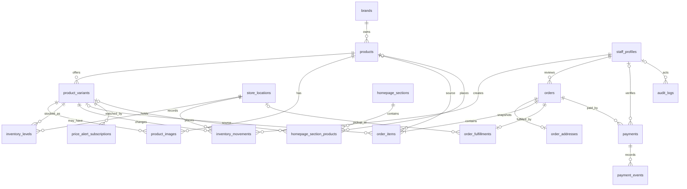

# GadgetMoTo Database Schema Plan

## Migration status

Migration 1, `20260717145303_catalog_foundation.sql`, was deployed successfully. Local and remote migration histories match. The remote schema now contains the five empty catalog tables: `brands`, `products`, `product_variants`, `product_images`, and `store_locations`. RLS is enabled on every catalog table; no policies or public grants were added, and Data API access remains unavailable. Inventory, commerce, staff, content, policy, API-access, and seed migrations remain deferred.

## Migration 2 status

Inventory Migration 2, `20260717160808_inventory_foundation.sql`, was deployed successfully. Local and remote migration histories match, and the empty `inventory_levels` and `inventory_movements` tables now exist remotely. RLS is enabled on both tables; no policies or public grants exist, and Data API access remains disabled. `inventory_movements` remains append-oriented, with no automatic stock mutation or reservation function. Exact stock quantities remain staff/server only, while reservation expiry and preorder behavior remain unresolved.

## Commerce Migration 3 status

Commerce Migration 3, `20260717164359_commerce_foundation.sql`, was deployed successfully. Migration version `20260717164359` matches locally and remotely. The empty `staff_profiles`, `orders`, `order_addresses`, `order_items`, `order_fulfillments`, `payments`, and `payment_events` tables now exist remotely, bringing the application-table count to fourteen. The planned `inventory_movements.created_by` staff-profile foreign key is in place.

RLS is enabled on all seven commerce tables with zero policies, Data API access is disabled, and no public commerce access exists. No trusted order-creation function, inventory reservation automation, or payment-provider integration exists yet. Staff account creation and role assignment remain deferred.

## Migration 4 status

Migration 4, `20260717184621_content_alerts_audit_foundation.sql`, was deployed successfully. Migration version `20260717184621` matches locally and remotely. The empty `price_alert_subscriptions`, `homepage_sections`, `homepage_section_products`, and `audit_logs` tables now exist remotely, completing the planned 18-table application schema. All 18 application tables currently contain zero rows.

RLS is enabled on all four Migration 4 tables with zero policies, Data API access remains disabled, and no public homepage, alert, or audit access exists. No alert workflow, email integration, homepage seed data, safe view, public policy, scheduled job, or audit automation exists yet.

## Secure order transaction migration status

Migration `20260726121534_secure_order_transaction_schema.sql` was deployed successfully. Migration version `20260726121534` matches locally and remotely. Together with the later physical-RAM correction, all eight deployed migrations are user-confirmed as synchronized and remain immutable.

The migration adds an `order_submissions` idempotency table, an `inventory_reservations` table and reservation-status enum, optional customer email, hashed order lookup tokens, duplicate line protection, required single-location fulfillment allocation, payment-attempt idempotency fields, reservation-linked inventory movement constraints, total-integrity checks, and append-only enforcement for operational history. It also creates a non-login `gadgetmoto_order_service` privilege role with server-only RLS policies and minimum grants for trusted order creation. It creates no login role, password, browser/Data API policy, seed record, tax rule, delivery-fee rule, payment-provider action, or public write path.

The separate application transaction uses the deployed schema but has not been
called. Login credentials, store-location data, inventory data, and controlled
database validation remain outside this documentation checkpoint.

## Product physical-RAM correction status

Forward-only migration
`20260726175847_correct_product_physical_ram.sql` is deployed and synchronized.
It matches only the complete canonical SKUs for Infinix
Note 60 Pro 5G and TECNO Camon 50, sets `ram_gb` to 8, and sets
`variant_name` to `8GB RAM + 8GB Extended / 256GB`. It does not change SKU,
storage, prices, SRPs, badges, financing, activation, inventory, product rows,
or ordering. All eight deployed migrations remain immutable.

## Scope and design principles

This document is the production data-model plan only. It does not create SQL, migrations, policies, functions, seed data, or a remote Supabase connection. The plan contains 18 application tables.

## Catalog-data bootstrap planning

All eighteen application tables are deployed. Initial catalog-data mapping is documented in `docs/catalog-data-import-plan.md`. The deployed bootstrap contains only approved brands, products, and variants: 6 brand rows, 12 product rows, and 12 product-variant rows. Product media and store locations remain deferred because required details are unconfirmed. Inventory, homepage, commerce, alerts, and audit tables remain empty.

Catalog bootstrap decisions are approved in `docs/catalog-bootstrap-decisions.md`. Catalog bootstrap migration `20260717205111_catalog_bootstrap_data.sql` is deployed, and version `20260717205111` matches locally and remotely. Current row counts are 6 brands, 12 products, and 12 product variants; all remaining application tables have zero rows. The 18-table schema is unchanged because the bootstrap created no schema object.

Product statuses, featured flags, publication timestamps, variant activation, SKUs, prices, and confirmed SRPs were manually verified. Product images, locations, inventory, homepage, commerce, alerts, and audit records remain absent. Application integration with PostgreSQL remains deferred.

The database contains the approved catalog records, while application integration is documented in `docs/catalog-database-integration-plan.md`. Migration `20260717234135_catalog_ordering_storefront_read_model.sql` is deployed, and all six migration versions match locally and remotely. `public.products.sort_order` is non-null and constrained to nonnegative values; the 12 existing catalog rows use the exact approved values 0 through 11. No product-ordering index exists.

The dedicated `storefront.catalog_products` view exists with 17 approved fields and currently returns 12 manually verified catalog rows. The `gadgetmoto_storefront_reader` role exists as a `NOLOGIN`, non-superuser role with no password. Its migration grants are limited to `USAGE` on the `storefront` schema and `SELECT` on the view. No browser-facing access, Data API exposure, public write path, or application database integration exists. The 18 application tables and their existing row counts remain otherwise unchanged.

The manually configured `gadgetmoto_storefront_app` role exists as a `LOGIN` role. It is not a superuser and cannot create roles or databases, bypass RLS, or replicate. It inherits `gadgetmoto_storefront_reader`, can use the `storefront` schema, and can select `storefront.catalog_products`. It cannot directly select `public.products` or `public.orders`; no base-table write or private-table read privilege was introduced. Membership verification changed no application data or schema object, and no credential is documented here.

- PostgreSQL is the source of truth. Products and prices must not be permanently duplicated across application systems.
- Cart contents remain client-side until a real order is submitted. A trusted server workflow will create orders.
- Order items preserve purchase-time names, variants, SKUs, and prices even when catalog records later change.
- Money is stored as integer centavos, never floating-point values.
- Public visitors may eventually read only published storefront content. Guest visitors never receive unrestricted direct write access to sensitive order or payment tables.
- Staff writes require authenticated, active staff authorization. Client-controlled metadata alone is not sufficient authorization.
- Row Level Security (RLS) will be enabled on every application table exposed through the Data API.
- Secrets and payment credentials do not belong in ordinary public tables. Card numbers, CVVs, passwords, Maya credentials, GCash PINs, and full bank credentials must never be stored.
- Soft deletion, archival, or active-status fields are preferred when hard deletion would damage historical integrity.
- All timestamps use `timestamptz`. Every table has a primary key; operational tables use `created_at` and `updated_at` where useful.
- Database constraints supplement application validation and enforce critical invariants.

## Planned enums

| Enum | Values |
| --- | --- |
| `product_category` | `phone`, `tablet` |
| `product_condition` | `brand_new`, `pre_loved`, `open_box`, `refurbished` |
| `product_status` | `draft`, `active`, `archived` |
| `product_badge` | `new`, `sale`; no badge is `NULL` |
| `inventory_movement_type` | `initial`, `purchase`, `sale`, `reservation`, `reservation_release`, `adjustment`, `return`, `damage` |
| `order_status` | `draft`, `pending_review`, `confirmed`, `awaiting_payment`, `paid`, `processing`, `ready_for_pickup`, `shipped`, `completed`, `cancelled` |
| `delivery_method` | `nationwide_delivery`, `same_day_delivery`, `store_pickup` |
| `fulfillment_status` | `pending_confirmation`, `confirmed`, `preparing`, `ready_for_pickup`, `dispatched`, `delivered`, `completed`, `cancelled` |
| `payment_method` | `maya_online`, `maya_manual`, `gcash`, `bank_transfer`, `cash_on_pickup`, `home_credit`, `skyro`, `ggives`, `atome`, `billease`, `maya_credit` |
| `payment_status` | `pending`, `instructions_pending`, `awaiting_payment`, `processing`, `paid`, `failed`, `cancelled`, `refunded`, `partially_refunded` |
| `staff_role` | `owner`, `administrator`, `sales`, `inventory`, `content` |
| `price_alert_status` | `active`, `notified`, `unsubscribed` |

Cash on delivery is intentionally absent. Only `brand_new` is active at launch. Final enum names may change during migration review, but their business meanings must remain explicit.

## Planned tables

### `brands`

- Purpose: canonical product-brand list. Initial examples include Xiaomi, POCO, Apple, Infinix, TECNO, Vivo, Oppo, Itel, Nubia, OnePlus, Samsung, and iQOO; no data is seeded yet.
- Primary key: `id uuid`.
- Columns: `name text`, `slug text`, nullable `description text`, `is_active boolean`, `sort_order integer`, `created_at`, `updated_at`.
- Relationships: one brand has many products.
- Integrity and indexes: nonblank name; unique slug; case-insensitive unique name using a normalized functional index or `citext`, selected during migration review; indexes for slug, active/sort ordering.
- Lifecycle/access: deactivate rather than delete when referenced. Public read is limited to active brands; staff manages records; service has controlled access.

### `products`

- Purpose: model-level information shared by purchasable variants.
- Primary key: `id uuid`.
- Columns: `brand_id`, `name`, `slug`, `category product_category`, nullable `short_description`, `status product_status`, `is_featured`, nullable `published_at`, `created_at`, `updated_at`.
- Foreign key: `brand_id -> brands.id` with restrictive deletion.
- Integrity and indexes: unique slug; trimmed name must not be blank; indexes on brand, and category plus status; optional published/featured indexes only when queries justify them. No unverified specification columns are introduced.
- Lifecycle/access: archive rather than hard-delete. Public reads require active/published records and active brands; authorized inventory/content staff manage appropriate fields.

### `product_variants`

- Purpose: purchasable RAM/storage variants and pricing.
- Primary key: `id uuid`.
- Columns: `product_id`, `sku`, `variant_name`, nullable `ram_gb`, `storage_gb`, `condition product_condition`, `current_price_centavos`, nullable `srp_centavos`, nullable `badge product_badge`, `financing_available`, `is_active`, `sort_order`, `created_at`, `updated_at`.
- Foreign key: `product_id -> products.id` with restrictive deletion.
- Integrity and indexes: unique SKU; unique product plus normalized variant name; positive storage; positive RAM when supplied; nonnegative prices; supplied SRP cannot be below current price; indexes on product and active ordering. Apple iPhone 17 has no confirmed RAM value, so `ram_gb` remains nullable.
- Lifecycle/access: deactivate rather than delete, especially once referenced by orders. Public reads only active variants of published products; authorized staff writes.

### `product_images`

- Purpose: ordered product media metadata, supporting images first and video later.
- Primary key: `id uuid`.
- Columns: nullable `product_id`, nullable `variant_id`, `storage_path`, `alt_text`, `media_type`, `sort_order`, `is_primary`, `created_at`.
- Foreign keys: product and variant references use restrictive or controlled deletion.
- Integrity and indexes: at least one owner must be supplied; migration review may require exactly one owner if shared records are unnecessary; nonblank storage path and alt text; indexes on product/order and variant/order; partial uniqueness should prevent multiple primary media records per applicable owner.
- Lifecycle/access: raw image binary is never stored here; `storage_path` later references Supabase Storage. Public reads only media attached to published catalog content; staff writes.

### `store_locations`

- Purpose: current Cavite City branch with future multi-branch support.
- Primary key: `id uuid`.
- Columns: `name`, `slug`, `city`, `province`, nullable `public_address`, nullable `pickup_instructions`, `is_active`, `created_at`, `updated_at`.
- Integrity and indexes: unique slug; required nonblank name/city/province; index active locations. The exact current address is not assumed.
- Lifecycle/access: deactivate rather than delete when historically referenced. Active public locations may be read; staff manages them.

### `inventory_levels`

- Purpose: current on-hand and reserved quantity by variant and location.
- Primary key: `id uuid`.
- Columns: `variant_id`, `location_id`, `quantity_on_hand`, `quantity_reserved`, nullable `reorder_level`, `updated_at`.
- Foreign keys: variant and location, both restrictive.
- Integrity and indexes: unique `(variant_id, location_id)`; quantities and reorder level cannot be negative; reserved cannot exceed on-hand unless a later documented backorder policy changes this. Available quantity is derived as `quantity_on_hand - quantity_reserved`.
- Lifecycle/access: no stock quantities are claimed in this plan. Exact levels are staff/service only and should not be publicly readable; deletes are tightly controlled.

### `inventory_movements`

- Purpose: append-oriented inventory audit trail.
- Primary key: `id uuid`.
- Columns: `variant_id`, `location_id`, `movement_type inventory_movement_type`, `quantity_delta`, nullable `reference_type`, nullable `reference_id`, nullable `notes`, nullable `created_by`, `created_at`.
- Foreign keys: variant, location, and nullable `created_by -> staff_profiles.user_id`.
- Integrity and indexes: delta cannot be zero; indexes on `(variant_id, created_at)`, `(location_id, created_at)`, and references when needed.
- Lifecycle/access: records are not normally updated or deleted; no public access; inventory staff and trusted server workflows append them.

### `staff_profiles`

- Purpose: application-specific staff authorization linked to Supabase Auth.
- Primary key: `user_id uuid`.
- Columns: `display_name`, `role staff_role`, `is_active`, `created_at`, `updated_at`.
- Foreign key: `user_id -> auth.users(id)` with reviewed deletion behavior.
- Integrity and indexes: nonblank display name; indexes on active role where useful.
- Lifecycle/access: no customer profiles at launch and public users receive no staff row. Roles live in controlled database records, not merely client-controlled metadata. Active staff may read the minimum needed; owner/administrator manages authorization; service access is controlled.

### `orders`

- Purpose: guest commercial orders after real submission exists.
- Primary key: internal `id uuid`.
- Columns: unique `public_order_number`, `status order_status`, guest name/mobile/email, `delivery_method`, `payment_method`, merchandise subtotal, nullable VAT rate in basis points, nullable VAT amount, delivery fee and final total (all money in centavos), nullable customer/internal notes, three consent timestamps, nullable reviewer/timestamps, and `created_at`/`updated_at`.
- Foreign key: nullable `reviewed_by -> staff_profiles.user_id`.
- Integrity and indexes: nonnegative monetary components; VAT basis points in a valid bounded range when known; `cash_on_pickup` only with `store_pickup`; unique public number; indexes on `(status, created_at)`, public number, and customer email only where an operational lookup justifies its privacy cost. Controlled workflows enforce valid status transitions.
- Order number alternatives: a cryptographically random opaque token, a UUID-derived public identifier, or a server-generated timestamp-free random code can avoid guessable sequences. Collision handling, readability, support workflow, and entropy must be reviewed before choosing; the UUID remains internal.
- Lifecycle/access: guest accounts are not required; no raw payment credentials. Final total may remain null until VAT and delivery are confirmed. No direct public access; validated server creation and authorized staff/service access only. Orders are not casually deleted.

### `order_addresses`

- Purpose: immutable delivery-address snapshot independent of future edits.
- Primary key: `id uuid`.
- Columns: `order_id`, street, province, city/municipality, barangay, postal code, `created_at`.
- Foreign key: `order_id -> orders.id` with restrictive/cascading behavior considered only as part of an exceptional controlled order deletion.
- Integrity and indexes: unique order ID enforces at most one address; required trimmed fields; application/database workflow requires one for delivery and none for pickup. Index on order is covered by uniqueness.
- Lifecycle/access: this is not a reusable address book because customer accounts do not exist. Sensitive staff/service access only; no public reads or writes.

### `order_items`

- Purpose: purchase-time product-line snapshot.
- Primary key: `id uuid`.
- Columns: `order_id`, nullable `product_id`, nullable `variant_id`, product/brand/variant/SKU snapshots, `unit_price_centavos`, `quantity`, `line_total_centavos`, `created_at`.
- Foreign keys: order is required; product/variant references use restrictive or nullable historical-safe behavior.
- Integrity and indexes: quantity positive; unit price and line total nonnegative; line total equals unit price times quantity; required snapshot strings nonblank; index order ID.
- Lifecycle/access: snapshots survive source-product archival. No direct public access; trusted server creates them and authorized staff/service reads them.

### `order_fulfillments`

- Purpose: delivery or pickup progress separated from commercial order status.
- Primary key: `id uuid`.
- Columns: `order_id`, `status fulfillment_status`, nullable `location_id`, courier name, tracking number, same-day confirmation notes, pickup schedule, dispatch/delivery timestamps, `created_at`, `updated_at`.
- Foreign keys: order and optional store location.
- Integrity and indexes: normally one fulfillment per order initially (unique order ID); pickup requires a location while delivery fields follow the selected method; timestamp consistency constraints reviewed with workflow. No courier is invented.
- Lifecycle/access: staff/service only; historical records are retained rather than casually deleted.

### `payments`

- Purpose: payment intent and staff/server-confirmed status.
- Primary key: `id uuid`.
- Columns: `order_id`, `method payment_method`, `status payment_status`, nullable amount, external reference, provider checkout/payment IDs, proof storage path, staff notes, verifier/timestamp, `created_at`, `updated_at`.
- Foreign keys: order and nullable `verified_by -> staff_profiles.user_id`.
- Integrity and indexes: amount nonnegative when supplied; unique partial indexes on each supplied external/provider identifier; indexes on order and status. Method compatibility must match the order.
- Lifecycle/access: never store card number, CVV, Maya secret, GCash PIN, passwords, or full bank credentials. Browser redirects never establish success; Maya requires verified server-side provider data or webhook processing. Staff/service only and not casually deleted.

### `payment_events`

- Purpose: append-only provider and staff workflow event history.
- Primary key: `id uuid`.
- Columns: `payment_id`, `event_type`, nullable `external_event_id`, minimized/redacted nullable `payload jsonb`, `created_at`.
- Foreign key: payment with restrictive deletion.
- Integrity and indexes: nonblank event type; unique partial external event ID provides idempotency; index payment/time.
- Lifecycle/access: no secrets in payload; minimize provider payloads and redact sensitive/irrelevant personal data. Server and authorized staff only; no normal update/delete.

### `price_alert_subscriptions`

- Purpose: guest consent for variant-specific price-drop notifications.
- Primary key: `id uuid`.
- Columns: `variant_id`, normalized email, `status price_alert_status`, `consent_at`, nullable last-notified price/time, `unsubscribe_token_hash`, `created_at`, `updated_at`.
- Foreign key: variant with restrictive deletion.
- Integrity and indexes: valid normalized nonblank email; nonnegative notified price; token hash unique; partial unique active subscription per normalized email plus variant; index `(variant_id, status)`.
- Lifecycle/access: plaintext unsubscribe tokens are not stored. No public reads or unrestricted writes; validated server/Edge Function creation and controlled service/staff access. Mark unsubscribed subject to final privacy rules.

### `homepage_sections`

- Purpose: staff-managed homepage presentation configuration.
- Primary key: `id uuid`.
- Columns: `section_key`, nullable title/subtitle, `content jsonb`, `is_active`, `sort_order`, nullable start/end times, `created_at`, `updated_at`.
- Integrity and indexes: unique nonblank key; end after start when both supplied; indexes for active scheduling and ordering. JSON is limited to flexible display settings, never core catalog, inventory, order, or payment records.
- Lifecycle/access: active in-window sections may be public-readable; content staff manages them; inactive/unpublished data remains private.

### `homepage_section_products`

- Purpose: ordered curated product or variant placements.
- Primary key: composite `(section_id, sort_order)` or a UUID selected during migration review; every table retains an explicit primary key.
- Columns: `section_id`, nullable `product_id`, nullable `variant_id`, `sort_order`, `created_at`.
- Foreign keys: section, product, and variant.
- Integrity and indexes: exactly one of product or variant is supplied; unique section/product and section/variant partial constraints prevent duplicate placement; unique section/sort order; indexes on referenced product/variant.
- Lifecycle/access: follows parent section publication and catalog visibility for public reads; content staff writes; controlled cascade from a deleted draft section only.

### `audit_logs`

- Purpose: important staff administrative action history.
- Primary key: `id uuid`.
- Columns: nullable `actor_user_id`, `action`, `entity_type`, nullable `entity_id`, nullable redacted before/after JSON, `created_at`.
- Foreign key: actor may reference `staff_profiles.user_id` with historical-safe nulling.
- Integrity and indexes: nonblank action/entity type; indexes on `(actor_user_id, created_at)` and `(entity_type, entity_id, created_at)`.
- Lifecycle/access: append-only, staff/service only. Secrets, complete payment credentials, and unnecessary personal data must be redacted and never logged.

## `updated_at` strategy

A reusable `BEFORE UPDATE` database trigger will assign the transaction timestamp to `updated_at`; its function and attachment will be reviewed and implemented in a future migration. It applies to brands, products, variants, locations, inventory levels, staff profiles, orders, fulfillments, payments, price-alert subscriptions, and homepage sections. `product_images`, addresses, order items, and placements are created records without an automatic update requirement unless workflows later prove one. Append-only `inventory_movements`, `payment_events`, and `audit_logs` must not receive update triggers and should reject ordinary updates/deletes.

## Order-total integrity

- Merchandise subtotal is derived from order items. Client-submitted prices are never authoritative.
- VAT rate and amount remain nullable until the applicable rate is confirmed. Delivery fee remains nullable until delivery details are confirmed.
- Final total remains nullable until all required components are known.
- Trusted server-side order creation looks up canonical current prices and copies purchase-time values into order-item snapshots.
- Item totals, merchandise subtotal, and final totals are recalculated and validated server-side inside the same database transaction as order creation or approved repricing.

## Inventory reservation strategy

1. A guest submits through a validated trusted server function.
2. The server verifies variants and canonical prices.
3. It checks derived available inventory.
4. In one transaction it creates the order and item snapshots.
5. It reserves stock when the approved workflow requires reservation.
6. It records append-only inventory movements.
7. Staff confirms delivery, VAT, fees, availability, and payment instructions.
8. Cancellation or expiry releases reservations and records the release.

Reservation expiry is not designed yet. The migration/database-function phase must protect against races through transactional row locking or an equivalent atomic conditional update so concurrent orders cannot reserve the same available units.

## Access and RLS plan

`authenticated non-staff` receives no extra business-table privileges merely by signing in. “Staff” always means an authenticated user with an active controlled `staff_profiles` record and a permitted role.

| Table | Anon | Authenticated non-staff | Active staff | Service/server |
| --- | --- | --- | --- | --- |
| brands | Read active via restricted table/view | Same | Role-appropriate manage | Controlled full |
| products | Read published active | Same | Inventory/content manage | Controlled full |
| product_variants | Read active under published products | Same | Inventory manage; content visibility as allowed | Controlled full |
| product_images | Read published media | Same | Content/inventory manage | Controlled full |
| store_locations | Read active public fields | Same | Admin manage; sales read | Controlled full |
| inventory_levels | None; exact quantities hidden | None | Inventory manage; sales limited read if approved | Controlled full |
| inventory_movements | None | None | Inventory append/read; admin oversight | Controlled append/read |
| staff_profiles | None | Own authorization result only through safe policy if needed | Minimum staff directory; owner/admin manage | Controlled full |
| orders | None direct | None direct | Sales/admin manage; other roles only if required | Validated create/manage |
| order_addresses | None | None | Sales/admin minimum required access | Validated create/manage |
| order_items | None | None | Sales/admin read/manage through order workflow | Validated create/manage |
| order_fulfillments | None | None | Sales/admin manage | Controlled full |
| payments | None | None | Sales/admin payment review; least privilege | Provider/server manage |
| payment_events | None | None | Authorized sales/admin read; controlled staff append | Append/read |
| price_alert_subscriptions | None | None | Limited authorized operational access | Validated create/manage |
| homepage_sections | Read active scheduled | Same | Content/admin manage | Controlled full |
| homepage_section_products | Read placements whose section/catalog records are public | Same | Content/admin manage | Controlled full |
| audit_logs | None | None | Owner/admin read; services append; other staff only if justified | Append/read |

There are no unrestricted anonymous table inserts. Future guest orders and alerts use validated server routes, narrowly privileged security-definer functions if justified, or Supabase Edge Functions. Owner/administrator has full administrative responsibility; sales handles orders, fulfillment, customer communication, and payment review; inventory handles catalog variants, inventory levels, and movements; content handles published catalog content and homepage sections. Exact grants, views, role boundaries, and RLS policies require separate migration-phase review.

Migration 1 defaults the five catalog tables to inaccessible through explicit RLS enablement and revocation of `anon` and `authenticated` privileges. A later access migration will add only narrowly scoped public-read policies and the minimum required `SELECT` grants. Sensitive or unpublished records remain inaccessible by default.

## Search and index plan

Initial database search uses indexed brand name/slug, product name/slug, variant name, and SKU; the existing client-side filtering may remain during migration. A later phase may add PostgreSQL full-text search across confirmed storefront fields. Embeddings, vector search, semantic search, and AI infrastructure are not initially required.

Planned indexes are driven by real queries: `brands.slug`; `products.slug`, brand, and category/status; variants by product and SKU; unique inventory variant/location; movements by variant/time; orders by public number and status/time, with customer-email lookup only where operationally justified; items by order; payments by order and supplied external reference; supplied payment event ID; alerts by variant/status; homepage active scheduling; audit actor/time and entity/type/ID/time. Excess indexes will not be added without measured query need.

## Deletion and archival policy

- Brands and products are generally deactivated or archived instead of deleted; order-referenced variants are not hard-deleted.
- Historical item snapshots survive catalog archival.
- Orders, payments, inventory movements, payment events, and audit logs are not casually deleted.
- Personal-data deletion and retention require later legal/business review. The draft privacy policy states no final retention period.
- Price alerts may be marked unsubscribed rather than immediately erased, subject to final privacy requirements.

No legal retention period is assumed.

## Proposed migration phases

1. Extensions only if genuinely required; enums; reusable `updated_at` helper; core catalog tables; locations; product images.
2. Inventory tables, constraints, and movement strategy.
3. Staff profiles, orders, addresses, items, fulfillments, payments, and payment events.
4. Price alerts, homepage content, and audit logs.
5. RLS enablement, grants, initial policies, and secure views/functions.
6. Deploy the reviewed 12-product catalog bootstrap after schema approval. This phase is complete.

The four schema migrations and the catalog bootstrap data migration are deployed and unchanged, and the planned 18-table application schema is present. Trusted order creation, inventory reservation behavior, staff-access policies, public API access, alert workflows, email integration, homepage content, audit automation, and payment-provider integration remain deferred.

## Entity relationships

## Open business decisions

These do not block schema planning, but must be resolved before their relevant migration or feature:

- GadgetMoTo VAT registration and applicable tax handling
- Exact warranty types and terms
- Final cancellation, refund, and return rules
- Inventory reservation expiry duration
- Whether preorder inventory may go below zero
- Final public order-number format
- Exact branch address and pickup schedule
- Courier providers and delivery-pricing rules
- Maya webhook and checkout requirements
- Manual payment proof-upload process
- Staff role assignments
- Data retention and deletion policies
- Price-alert email provider
- Final product specification fields
- Imported-unit classification, if later required
